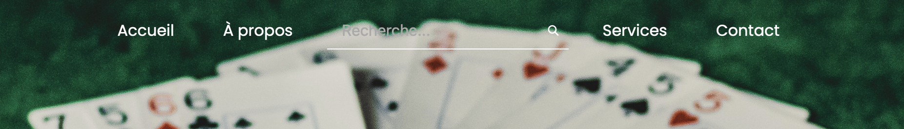

# Animated-SearchBar

La Animated-SearchBar est une barre de recherche moderne et épurée avec une animation d'apparition. Elle est conçue pour s'intégrer harmonieusement dans n'importe quelle page web et est facilement personnalisable pour correspondre à votre style.

## Fonctionnalités

- Animation d'Apparition: Lorsque vous cliquez sur la barre de recherche, une nouvelle barre apparaît de manière fluide, offrant à l'utilisateur un espace dédié pour ses recherches.
- Responsive Design: Ajuste sa taille et sa disposition en fonction de la taille de l'écran, garantissant une expérience utilisateur optimale sur tous les appareils.
- Stylisation Élégante: Conçu avec une esthétique moderne et épurée, il ajoute une touche d'élégance à n'importe quelle page web.

## Comment l'utiliser ?

1. Intégration:
    - Clonez le repo.
    - Ouvire le fichier index.html dans votre navigateur.
2. Activation:
    - Cliquez simplement sur la barre de recherche pour voir l'animation se déclencher et la nouvelle barre apparaître.

## Personnalisation

- Les couleurs en modifiant les propriétés CSS appropriées.
- La durée et le style de l'animation en ajustant les propriétés de transition dans le CSS.
- La taille et la police en ajustant les propriétés CSS concernant la police et les dimensions.

## Contribution

Si vous avez des suggestions ou des améliorations, n'hésitez pas à ouvrir une issue ou à soumettre une pull request. Toutes les contributions sont les bienvenues!